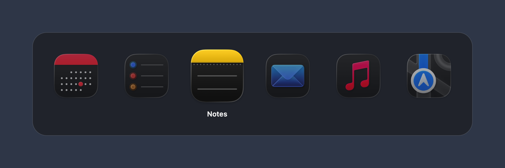
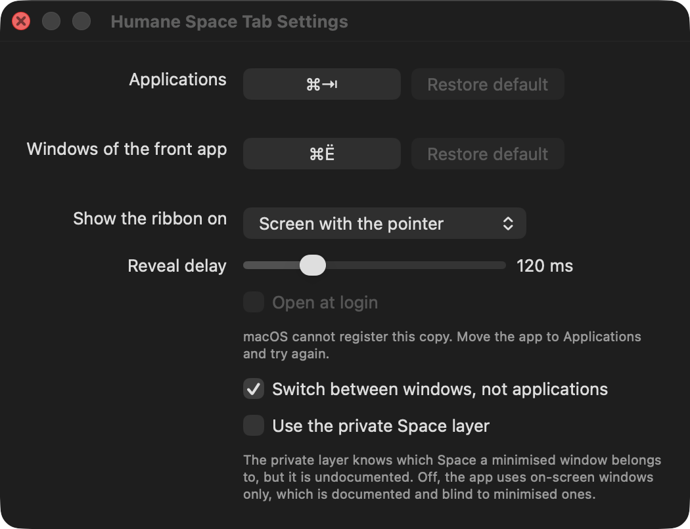

# Como usar o Humane Space Tab

[English](guide.md) · [Русский](guide.ru.md) · [Deutsch](guide.de.md) ·
[Français](guide.fr.md) · [Español](guide.es.md) · **Português (Brasil)** ·
[Italiano](guide.it.md) · [Nederlands](guide.nl.md) · [Polski](guide.pl.md) ·
[Türkçe](guide.tr.md) · [Українська](guide.uk.md) · [日本語](guide.ja.md) ·
[한국어](guide.ko.md) · [简体中文](guide.zh-Hans.md) · [繁體中文](guide.zh-Hant.md)

O app não tem janela própria para trabalhar: ele vive na barra de menus, e tudo o que faz
acontece enquanto um atalho está pressionado.

## Primeira execução

1. Instale — `brew install --cask n0sfer/tap/humane-space-tab`, ou abra a imagem de disco
   em Releases e arraste o **Humane Space Tab.app** para o atalho de Applications — e
   abra o app.
2. Um app baixado é recusado na primeira vez: abra **Ajustes do Sistema → Privacidade e
   Segurança**, role até o fim, clique em **Abrir Assim Mesmo** e abra de novo.
3. Ao iniciar, o app pede **Acessibilidade**. Conceda em **Ajustes do Sistema →
   Privacidade e Segurança → Acessibilidade**. O alternador começa a funcionar em alguns
   segundos; não é preciso reabrir o app.

O ícone na barra de menus é a única prova de que o app está rodando: `⇄` quando funciona,
um triângulo de aviso quando não consegue. O macOS amarra a permissão à assinatura do
código, então ela precisa ser concedida de novo depois de cada atualização.

## Alternar entre apps

Segure **⌘** e toque **Tab**. O que acontece depende de quanto tempo você segura:

- **Um toque rápido** — abaixo da espera (120 ms por padrão) — alterna para o app anterior
  sem mostrar nada, como a memória do gesto espera.
- **Mantenha ⌘ pressionada** e a faixa aparece com os apps da **área de trabalho atual**,
  os usados mais recentemente primeiro. Cada **Tab** seguinte move a seleção um passo.

Enquanto a faixa está aberta:

| Tecla | O que faz |
|---|---|
| **Tab** | um passo à frente |
| **⇧Tab** | um passo atrás |
| **Escape** | cancelar — nada é alternado |
| soltar **⌘** | alternar para o app selecionado |

O app selecionado é o ícone maior e mais forte, com o nome embaixo; os vizinhos ficam
esmaecidos. A partir de cinco apps a faixa vira um carrossel: a seleção mantém o lugar e os
ícones giram sob ela, então um passo é sempre a mesma distância para o olho e a lista não
tem pontas — depois do último app vem o primeiro. Abaixo de cinco, cada ícone fica no seu
lugar e só a seleção anda. A faixa para de crescer em dez posições.

Numa área de trabalho onde nada está aberto, a faixa ainda assim responde e diz que não há
nada ali, em vez de devolver a tecla ao alternador do sistema.

## Alternar entre as janelas de um app

Segure **⌘** e toque **`** (a tecla acima de Tab). A faixa lista as janelas do app em
primeiro plano — só as da área de trabalho atual, na ordem da pilha, cada uma com seu
título. O gesto é o mesmo: `⇧` inverte, Escape cancela, soltar **⌘** traz a janela à
frente.

O atalho do sistema conta as janelas de todas as áreas de trabalho de uma vez, e é assim
que ele joga você em outra. Este não pode: uma janela que não está aqui não está na lista,
então ele nunca muda de área de trabalho nem restaura nada do Dock.

## O mouse

Enquanto a faixa está aberta, o cursor age sobre ela:

- **mova o mouse** sobre um ícone para selecioná-lo — um cursor que apenas está onde a
  faixa abriu não muda nada até se mover;
- **clique** num ícone para alternar na hora, sem esperar soltar **⌘**;
- **role** sobre a faixa para andar com a seleção.

## Ajustes

Abrem pelo ícone da barra de menus → **Ajustes…**.

| Ajuste | O que é |
|---|---|
| **Apps** | o atalho que abre a faixa. Clique no campo e digite a combinação, ou use **Restaurar o padrão** para `⌘Tab`. |
| **Janelas do app em primeiro plano** | o segundo atalho, `` ⌘` `` por padrão. |
| **Mostrar a faixa em** | a tela com o foco do teclado, ou a tela onde está o cursor. |
| **Idioma** | o idioma da interface. **Sistema** segue o macOS; os idiomas que o app traz aparecem no próprio nome. Escolher um redesenha a janela na hora. |
| **Espera antes de aparecer** | quanto tempo o atalho precisa ficar pressionado até a faixa aparecer — de 0 a 500 ms. Em `0` ela aparece de imediato. |
| **Abrir ao iniciar a sessão** | registra o app no macOS como item de início. |
| **Alternar entre janelas, e não entre apps** | o `⌘Tab` passa a listar janelas, como no Windows e no Linux. Desligado por padrão: dois documentos de um mesmo editor viram duas entradas. |
| **Usar a camada privada das áreas de trabalho** | a camada privada sabe a que área de trabalho pertence uma janela guardada no Dock, mas não é documentada. Desligada, o app olha só as janelas na tela. |

O app traz quinze idiomas — inglês, russo, alemão, francês, espanhol, português (Brasil),
italiano, neerlandês, polonês, turco, ucraniano, japonês, coreano e as duas escritas
chinesas — e responde em inglês para qualquer outro. Neste guia os nomes dos ajustes são
citados em português.

Um atalho precisa de um modificador para segurar, e o gravador recusa o que o desenho não
consegue cumprir — uma combinação sem modificador, uma que já contém **⇧** (essa é a
direção inversa), **Escape**, `⌘Q` e `⌘W` — e diz qual desses casos era. O atalho é
desenhado com as teclas da sua fonte de entrada atual.

## Aparência

A segunda aba dos **Ajustes…** é a aparência da faixa, guardada em perfis. O **Padrão** é o
embutido e não pode ser editado: **Duplicar** faz uma cópia que pode, e **Nome** dá a ela um
nome seu. Cinco perfis além do embutido é o teto; apagar o ativo deixa o **Padrão** ativo.

| Ajuste | O que é |
|---|---|
| **Tamanho dos ícones** | o tamanho máximo com que um ícone é desenhado — uma faixa cheia os encolhe abaixo disso para caber na tela. |
| **Opacidade dos ícones** | com que força os ícones são desenhados. 100 % é o limite; abaixo disso a seleção continua se destacando, porque o preajuste esmaece tudo o que não está selecionado. |
| **Margem da faixa** | o espaço entre os ícones e a borda da faixa, como fração do ícone. |
| **Espaço entre os ícones** | o espaço entre dois ícones, na mesma fração. |
| **Raio dos cantos** | quão arredondados são os cantos da faixa. |
| **Moldura ao redor do ícone**, **Margem da moldura** | um contorno desenhado em volta do ícone e sua distância até ele. |
| **Fundo** | **Vidro** é o material do próprio sistema; **Escurecimento** o escurece, e em `0` a faixa é vidro puro, com a área de trabalho aparecendo através dela. **Transparente** e **Cor de fundo da janela** não têm material e são definidos só pela **Opacidade**. |
| **Carrossel** | com **Girar a fileira sob a seleção** desligado, a fileira fica parada e encolhe para caber; ligado, **Posições** diz em quantos ícones ela gira — de 5 a 12. |
| **Seleção** | como o ícone selecionado se distingue: como no alternador do sistema, maior, sozinho em destaque ou com moldura. |

Cada número tem um controle deslizante e um campo com o mesmo valor, e as faixas de valores
respondem umas às outras: alargar os espaços deixa menos lugar para a margem crescer.
**Mostrar um exemplo…** desenha a faixa com quantos apps fictícios você escolher, por
quatro segundos, sem atrapalhar a área de trabalho em que você está.

## A barra de menus

| Item | Quando aparece |
|---|---|
| **Abrir Acessibilidade…** | enquanto falta a permissão — pede de novo |
| **Abrir Monitoramento de Entrada…** | quando o macOS retém as teclas (veja abaixo) |
| **Ajustes…** | sempre |
| **Copiar a lista de apps e janelas** | sempre — copia para a área de transferência a lista de apps da área de trabalho atual, que é o que se anexa a um relato de erro |
| **Encerrar o Humane Space Tab** | sempre |

## Quando algo está errado

**Nenhum ícone na barra de menus.** Uma barra sem espaço livre à esquerda do entalhe
descarta o ícone: o macOS não desenha um item de estado que não cabe, e nada no app pode
tomar esse espaço. Libere um espaço, ou abra o app de novo pelo Finder ou pelo Spotlight —
uma segunda abertura mostra os ajustes, não uma segunda cópia.

**O ícone diz que o macOS está retendo as teclas.** Uma entrada antiga do app o proíbe em
**Ajustes do Sistema → Privacidade e Segurança → Monitoramento de Entrada**. Remova essa
entrada com **−** — o app não precisa da permissão, só da ausência de uma recusa — e clique
de volta no app; a captura é refeita sem reabrir nada.

**O `⌘Tab` ainda é o do sistema.** A permissão falta ou pertence à versão anterior. Use
**Abrir Acessibilidade…** e, se a lista já tiver uma entrada do app, remova-a com **−** e
conceda de novo.

**“Abrir ao iniciar a sessão” não fica.** Se o macOS recusar o registro, ele diz o motivo
com as próprias palavras abaixo da caixa. O motivo comum é uma versão que o sistema não
reconhece: cada compilação local traz sua própria assinatura ad hoc, então um registro
feito pela cópia de ontem não pertence à de hoje. Desligue e ligue de novo na cópia que
está em `/Applications`.

## O que o app enxerga

Ele tem a Acessibilidade, que é ampla, e faz de propósito muito pouco com ela: nenhum
código de rede, nenhum AppleEvent, nenhum plugin; as teclas só são examinadas para
reconhecer o seu atalho; os títulos das janelas só são lidos enquanto a alternância por
janelas está ligada, e apenas para serem desenhados; o cursor só é visto sobre a própria
faixa. Ele nunca pede Gravação de Tela, e é por isso que não mostra prévias de janelas. O
modelo de ameaças completo está em [S00](specs/S00-threat-model.md).
